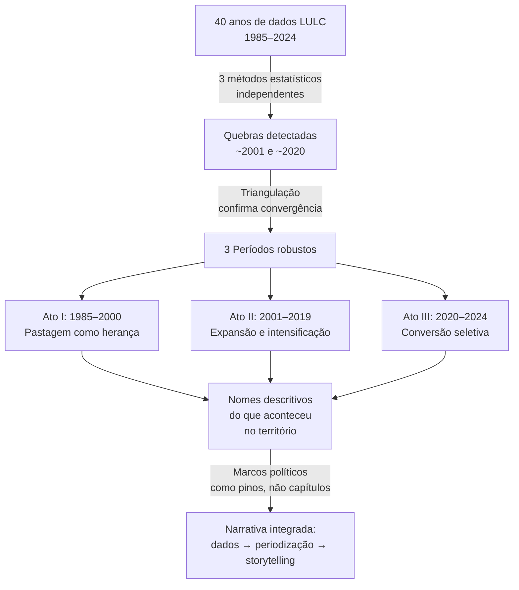

# Os 3 Atos: Como funcionam e por que fazem sentido

## O que são os Atos?

Os Atos são **3 períodos empíricos** que dividem os 40 anos de análise LULC (1985–2024) de Goiás. Eles não foram escolhidos arbitrariamente — as fronteiras temporais entre eles foram **detectadas estatisticamente** e depois receberam nomes narrativos que descrevem o que aconteceu no território em cada fase.

| Ato | Período | Nome narrativo | Protagonista |
|-----|---------|----------------|--------------|
| **I** | 1985–2000 | Pastagem como herança | Pastagem extensiva |
| **II** | 2001–2019 | Expansão e intensificação | Soja + commodity boom |
| **III** | 2020–2024 | Conversão seletiva | Frigoríficos + reorganização |

> [!IMPORTANT]
> Os Atos **não são capítulos políticos**. São períodos definidos pela **dinâmica observada do uso da terra**. Os marcos políticos (Plano Real, Lei Kandir, Código Florestal etc.) entram como "pinos" dentro dos Atos — inflexões datadas, não como o esqueleto da periodização.

---

## Como as fronteiras foram encontradas? (A triangulação de 3 métodos)

A pergunta-chave é: **por que o corte é em ~2001 e ~2020, e não em outros anos?**

A resposta vem de uma **triangulação de 3 métodos estatísticos independentes** (Pipeline #29), validados por **verificação de sanidade** (Pipeline #30) e um **diagnóstico complementar** (Pipeline #31 — Intensity Analysis). Quando métodos distintos convergem para os mesmos anos, a confiança de que ali existe uma mudança real (e não ruído) é muito alta.

### Método 1: sup-F multivariado (Pipeline #29a) — **Método primário**

O teste sup-F procura o ponto no tempo onde dividir a série em dois segmentos **maximiza a diferença estatística** entre eles. É como perguntar: "Em que ano a 'regra do jogo' mudou?"

- **~2001**: F = 62.2 (muito significativo) → Goiás mudou fundamentalmente de regime nesse ponto
- **~2020**: F = 21.5 (significativo) → Outra mudança de regime

O teste é **multivariado** — analisa simultaneamente vegetação natural, pastagem, agricultura e outras classes, não uma por vez. Isso evita encontrar quebras espúrias que aparecem numa variável isolada.

### Método 2: Rodionov STARS (Pipeline #29b) — **Sensibilidade**

O STARS (Sequential t-test Analysis of Regime Shifts) varre a série ano a ano procurando **mudanças abruptas na média**. Com parâmetros conservadores (α = 0.05, janela l = 5):

- Detecta shifts em **2004/2006** — compatível com a quebra ~2001 do sup-F
- Com α = 0.01 (mais rigoroso), **nada detecta** — evidência de que as quebras são moderadas, não cataclísmicas

### Método 3: KL/TV de matrizes de transição (Pipeline #29c) — **Sensibilidade**

Este método mede o quanto a **matriz de transição LULC** (quem virou o quê) muda de um ano para o seguinte. Se a matriz em 2002→2003 é muito diferente da matriz em 2001→2002, algo mudou na dinâmica de conversão.

- **Pico em 2003**: A forma como a terra mudava de classe alterou-se bruscamente
- **Pico em 2018–2020**: Outro momento de reorganização das transições

### Método 4: Intensity Analysis — Aldwaik & Pontius 2012 (Pipeline #31) — **Diagnóstico complementar**

Enquanto os 3 métodos anteriores detectam **onde** estão as quebras, o Intensity Analysis responde: **"a dinâmica de mudança LULC é realmente diferente entre esses períodos?"**

Ele opera em **3 níveis hierárquicos** (como um microscópio com zoom progressivo):

#### Nível 1 — Intervalo: a taxa total de mudança varia?

Para cada par de anos consecutivos (1985→86, 1986→87, ..., 2023→24), calcula-se:

```
taxa_anual = (área que mudou de classe) / (área total)
```

Depois agrupa essas taxas por Ato e testa estatisticamente se as distribuições diferem:
- **Kruskal-Wallis (3 períodos)**: H = 22.57, p < 0.001 → **Sim, os Atos diferem**
- Comparações par-a-par com Mann-Whitney + correção Bonferroni

#### Nível 2 — Categoria: ganho e perda de cada classe variam?

Zoom maior: para cada categoria (vegetação natural, pastagem, agricultura), calcula-se a **intensidade de ganho e perda** por Ato e compara com a intensidade "uniforme" (o que se esperaria se a mudança fosse aleatória).

- Se `perda_real / perda_uniforme > 1` → a categoria está perdendo **mais do que o esperado** naquele Ato
- Vegetação natural: perda acima do uniforme em todos os Atos, mas **5× mais intensa no início do Ato II** (2001-2005)

#### Nível 3 — Transição: fluxos específicos variam?

Zoom máximo: olha transições individuais (ex: pasto→agricultura, cerrado→pasto) e mede se a intensidade delas muda entre Atos.

- `pasto → agricultura`: intensidade cresce drasticamente no Ato II
- `veg_natural → pastagem`: intensidade cai do Ato I para o II (fronteira de pasto já consolidada)
- `veg_natural → agricultura`: pico no início do Ato II

> [!NOTE]
> O Intensity Analysis não "detecta" quebras — ele **valida** se as quebras encontradas pelos outros métodos correspondem a mudanças reais no regime de uso da terra. É o teste do "faz sentido?"

### A convergência dos 4 métodos

```
                              DETECÇÃO DE QUEBRAS
Método                    Quebra ~2001    Quebra ~2020
──────────────────────────────────────────────────────
sup-F (primário)              ✓ F=62.2      ✓ F=21.5
STARS                         ✓ 2004/06     —
KL/TV                         ✓ pico 2003   ✓ 2018-2020
──────────────────────────────────────────────────────
Concordância (detecção):      3/3           2/3

                       VALIDAÇÃO GLOBAL
Método                    Resultado
──────────────────────────────────────────────────────
Intensity Analysis        Kruskal-Wallis H = 22.57,
(Aldwaik & Pontius)       p < 0.001 (3 Atos diferem)
──────────────────────────────────────────────────────
```

> [!NOTE]
> Os 3 primeiros métodos **detectam** onde estão as quebras (cada um aponta anos específicos). O Intensity Analysis tem papel diferente: ele **valida globalmente** se os períodos resultantes são de fato distintos. O teste Kruskal-Wallis compara os 3 Atos simultaneamente — `H = 22.57` é a estatística do teste e `p < 0.001` é o p-valor desse mesmo teste. Não são detecções separadas para ~2001 e ~2020; são **um resultado único** que diz "os três períodos diferem significativamente em taxa de mudança LULC".

> [!TIP]
> A lógica é: **3 métodos independentes convergem para as mesmas fronteiras, e o 4º confirma que o que existe de cada lado delas é qualitativamente diferente**. É como ter três testemunhas que não se conhecem apontando o mesmo momento — e um perito que examina o antes e o depois e confirma que algo de fato mudou.

---

## Por que NÃO 4 ou 5 períodos?

Uma candidata a 4ª fronteira apareceu em **~2005/2006** — entre os métodos STARS e KL/TV. O **Intensity Analysis (Pipeline #31) foi decisivo para rejeitá-la**, funcionando como o "tribunal" que julgou a evidência:

1. **Não apareceu no método primário** (sup-F multivariado) — só nos métodos de sensibilidade
2. **Intensity Analysis — Nível 1 (taxa total)**: Mann-Whitney p = 0.060 (não significativo) → as sub-fases 2001–2005 e 2006–2019 **não diferem em velocidade geral de mudança**
3. **Intensity Analysis — Nível 2 (categoria)**: a perda de vegetação natural é 5× maior em 2001–2005 (p = 0.0008, altamente significativo) → **diferem em composição**, mas isso é intensidade de uma classe, não mudança de regime
4. **Bootstrap (verificação)**: IC 95% da diferença P2−P3 em taxa total **não contém zero** — resultado ambíguo, consistente com diferença pequena mas real
5. **Sensível ao ponto de corte**: significativa em 2005 (p = 0.046), marginal em 2004 (p = 0.10), não significativa em 2006 (p = 0.12)
6. **Sem o outlier 2004** (ano anômalo com taxa altíssima), p sobe para 0.189
7. **Poder estatístico insuficiente**: com n = 4 anos em P2, o teste Mann-Whitney tem poder de apenas 0.63 (precisaria de n = 7 para chegar a 0.83)

Decisão: documentar a sub-fase 2001–2005 como **nota metodológica** (aceleração composicional dentro do Ato II), sem promovê-la a fronteira de período.

> [!NOTE]
> Essa decisão é conservadora de propósito. É melhor ter 3 períodos robustos do que 4 onde o último corte é instável. Na dissertação, isso é um ponto de transparência metodológica — mostra que o candidato testou e descartou com critério.

---

## Verificações de sanidade (Pipelines #30 e #31-verificação)

### Pipeline #30 — Sanidade dos métodos de detecção

Valida se os métodos de detecção de quebras **não estão "vendo coisas"**:

| Teste | Resultado |
|-------|----------|
| Falso positivo (ruído branco) | FPR = 11% (aceitável para F_threshold = 4.0) |
| Robustez de 2001 | Estável em **9/9** combinações de parâmetros |
| Robustez de 2020 | Estável em **6/9** combinações |
| Robustez de 1991 (candidata descartada) | Instável — desloca entre 1989 e 1993 |
| Consistência uni vs multivariado | As 3 quebras multivariadas são subconjunto das 6 univariadas ✓ |

### Pipeline #31 — Sanidade do Intensity Analysis ([verificacao_intensity.py](file:///c:/Users/amara/OneDrive/Documentos/Antigravity/Mestrado/scripts/verificacao_intensity.py))

O Intensity Analysis tem seu **próprio script de verificação** com 5 testes:

| Teste | O que verifica | Resultado |
|-------|---------------|----------|
| 1. Consistência de dados | Matrizes anuais somam para o estoque correto? | Diferença < 1.7% ✓ |
| 2. Simetria | Perda de A→B = ganho de B vindo de A? | Consistente ✓ |
| 3. Poder estatístico | Mann-Whitney com n=4 é confiável? | Poder = 0.63 (n=4), 0.83 (n=7) |
| 4. Sensibilidade da fronteira | Resultado muda se cortar em 2003/2004/2006? | Sim — fronteira instável |
| 5. Bootstrap | IC 95% da diferença P2−P3 contém zero? | Não contém (taxa total); Não contém (veg_nat) |

> [!IMPORTANT]
> O teste de **poder** é particularmente revelador: com apenas 4 anos no sub-período P2 (2001–2005), o Mann-Whitney tem poder de 63% — ou seja, **há 37% de chance de não detectar uma diferença real mesmo se ela existir**. Com n=7 (se o sub-período tivesse 7 anos), o poder subiria para 83%. Isso reforça a decisão de não criar um 4º Ato: a evidência é insuficiente para concluir, mas também insuficiente para descartar — a postura conservadora é documentar e manter 3 períodos.

---

## O que cada Ato significa no território

### Ato I — Pastagem como herança (1985–2000)

Goiás entra na série com um padrão herdado: **pecuária extensiva dominante**, grandes áreas de pastagem degradada, vegetação natural ainda significativa. A dinâmica é relativamente estável — conversões acontecem, mas em ritmo lento. É a "inércia" do modelo agropecuário pré-estabilização econômica.

- **Protagonista**: Pastagem extensiva (ocupa mais da metade do estado)
- **Marcos dentro do ato**: Plano Real (1994), Lei Kandir (1996) — esta última é o **único marco com evidência causal GO-específica** (quebra em veg_nat 1998, F = 86.6, DiD robusto p = 0.005)
- **Dinâmica**: Lenta conversão de cerrado em pasto; soja ainda incipiente

### Ato II — Expansão e intensificação (2001–2019)

A entrada da China na OMC (dez/2001) e a sistematização do crédito rural (Plano Safra 2002) detonam o super-ciclo de commodities. A soja explode em área plantada, substituindo pastagens degradadas e vegetação natural. É o período de **transformação acelerada** da matriz produtiva.

- **Protagonista**: Soja + commodity boom
- **Marcos dentro do ato**: Crédito/China (2002), boom de commodities (2003), Código Florestal (2012) — notavelmente, o Código Florestal **não produziu quebra estrutural detectável** (reserva legal de 20% no Cerrado é permissiva; a ausência de efeito é o achado)
- **Dinâmica**: Substituição massiva de pasto → soja; perda acelerada de vegetação natural; **pico de transformação na sub-fase 2001–2005** seguido de consolidação

### Ato III — Conversão seletiva (2020–2024)

O ritmo de conversão muda de natureza: não é mais expansão bruta de fronteira, mas **reorganização seletiva**. Frigoríficos consolidados (JBS, Marfrig, Minerva) reorganizam a geografia da pecuária; compromissos de cadeia (Cerrado Manifesto) criam pressão; o CAR limita novas aberturas legais.

- **Protagonista**: Frigoríficos + reorganização de cadeias
- **Marcos dentro do ato**: Reorganização de mercado (2018, que precede o ato), estado atual (2024)
- **Dinâmica**: Conversões menores em volume, mas direcionadas; **o que muda é a lógica, não o volume**

---

## Como os Atos são usados computacionalmente

Os Atos são definidos em uma **fonte única de verdade**: [config_periodos.py](file:///c:/Users/amara/OneDrive/Documentos/Antigravity/Mestrado/scripts/config_periodos.py)

```python
ATOS = {
    "I":   {"inicio": 1985, "fim": 2000, "titulo": "Pastagem como herança"},
    "II":  {"inicio": 2001, "fim": 2019, "titulo": "Expansão e intensificação"},
    "III": {"inicio": 2020, "fim": 2024, "titulo": "Conversão seletiva"},
}
```

Todos os scripts importam desse arquivo. Isso garante que se um dia a fronteira mudar (ex: após feedback do orientador), basta alterar **um único arquivo** e todos os outputs se atualizam.

### Na análise de transições ([analise_transicoes.py](file:///c:/Users/amara/OneDrive/Documentos/Antigravity/Mestrado/scripts/analise_transicoes.py))

Os Atos são usados para:

1. **Filtrar os dados brutos** — `filtrar_ato(df, ano_ini, ano_fim)` recorta as transições pixel-a-pixel dentro do período
2. **Gerar matrizes 6×6** — uma matriz "quem virou o quê" por Ato (`matriz_transicao_ato_I.csv`, `_II.csv`, `_III.csv`)
3. **Gerar diagramas Sankey** — visualizações de fluxo por Ato para a peça interativa
4. **Calcular decomposição de origem** — "de onde veio cada hectare novo de soja/pasto?"
5. **Ranquear transições por mesorregião** — top-3 mudanças por região × Ato

### Na visualização interativa ([Visualizacao/](file:///c:/Users/amara/OneDrive/Documentos/Antigravity/Mestrado/Visualizacao))

Os Atos estruturam a **narrativa do scrollytelling**:
- Cada Ato tem um **cabeçalho narrativo** (~150 palavras) que aparece antes do primeiro ano daquele período
- As cores por Ato são consistentes entre scripts Python e JavaScript (paleta em `CORES_ATO`)
- Os 8 marcos políticos aparecem como **pinos na régua superior**, não como divisões de capítulo

---

## Resumo: Por que faz sentido?



Os Atos fazem sentido em **três camadas simultâneas**:

1. **Empírica**: As fronteiras ~2001 e ~2020 foram encontradas por 3 métodos estatísticos independentes e sobreviveram a testes de robustez
2. **Narrativa**: Cada Ato tem um protagonista concreto no território (pastagem → soja → frigoríficos), o que transforma números em história
3. **Computacional**: Uma fonte única de verdade (`config_periodos.py`) alimenta todos os scripts e a visualização, garantindo consistência
