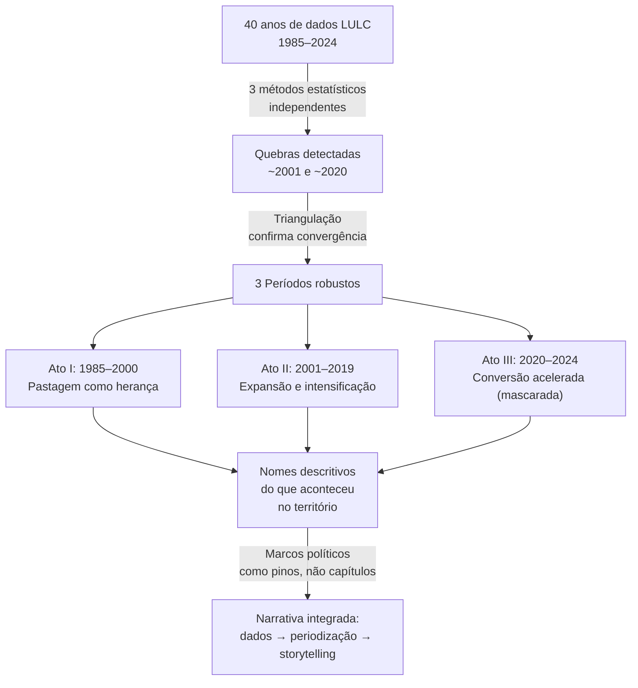

# Os 3 Atos: Como funcionam e por que fazem sentido

## O que são os Atos?

Os Atos são **3 períodos empíricos** que dividem os 40 anos de análise LULC (1985–2024) de Goiás. Eles não foram escolhidos arbitrariamente — as fronteiras temporais entre eles foram **detectadas estatisticamente** e depois receberam nomes narrativos que descrevem o que aconteceu no território em cada fase.

| Ato | Período | Nome narrativo | Protagonista |
|-----|---------|----------------|--------------|
| **I** | 1985–2000 | Pastagem como herança | Pastagem extensiva |
| **II** | 2001–2019 | Expansão e intensificação | Soja + commodity boom |
| **III** | 2020–2024 | Conversão acelerada (mascarada) | Aceleração que a medida crua esconde |

> [!IMPORTANT]
> Os Atos **não são capítulos políticos**. São períodos definidos pela **dinâmica observada do uso da terra**. Os marcos políticos (Plano Real, Lei Kandir, Código Florestal etc.) entram como "pinos" dentro dos Atos — inflexões datadas, não como o esqueleto da periodização.

---

## Como as fronteiras foram encontradas? (A triangulação de 3 métodos)

A pergunta-chave é: **por que o corte é em ~2001 e ~2020, e não em outros anos?**

A resposta vem de uma **triangulação de 3 métodos estatísticos independentes** (Pipeline #29), validados por **verificação de sanidade** (Pipeline #30) e um **diagnóstico complementar** (Pipeline #31 — Intensity Analysis). Quando métodos distintos convergem para os mesmos anos, a confiança de que ali existe uma mudança real (e não ruído) é muito alta.

### Método 1: sup-F multivariado (Pipeline #29a) — **Método primário**

O teste sup-F procura o ponto no tempo onde dividir a série em dois segmentos **maximiza a diferença estatística** entre eles. É como perguntar: "Em que ano a 'regra do jogo' mudou?"

- **~2001**: F = 62.2 (muito significativo) → Goiás mudou fundamentalmente de regime nesse ponto
- **~2020**: F = 21.5 (significativo) → Outra mudança de regime

> [!WARNING]
> O `F = 21.5` de 2020 sai da série de agricultura **crua**, que a deriva do Mosaico de Usos
> distorce (ver [D25/D26](Textos/metodologia/tratamento_deriva_mosaico.md)). Sob a régua corrigida
> — `agricultura ∪ mosaico` — a mesma quebra dá **F = 34,1**: a fronteira não só sobrevive à
> correção como fica **mais forte**. É o número a citar quando a pergunta for se o corte de 2020
> é artefato de classificador.

O teste é **multivariado** — analisa simultaneamente vegetação natural, pastagem, agricultura e outras classes, não uma por vez. Isso evita encontrar quebras espúrias que aparecem numa variável isolada.

### Método 2: Rodionov STARS (Pipeline #29b) — **Sensibilidade**

O STARS (Sequential t-test Analysis of Regime Shifts) varre a série ano a ano procurando **mudanças abruptas na média**. O que roda aqui é uma **versão simplificada** do detector de Rodionov (2004), e não o programa STARS v6.x — é assim que o texto de qualificação a nomeia, e a distinção importa porque o programa tem parâmetros (o peso de Huber, entre outros) que esta implementação não tem. Com parâmetros conservadores (α = 0.05, janela l = 5):

- Detecta shifts em **2004/2006** — compatível com a quebra ~2001 do sup-F
- Com α = 0.01 (mais rigoroso), **nada detecta** — evidência de que as quebras são moderadas, não cataclísmicas

### Método 3: KL/TV de matrizes de transição (Pipeline #29c) — **Sensibilidade**

Este método mede o quanto a **matriz de transição LULC** (quem virou o quê) muda de um ano para o seguinte. Se a matriz em 2002→2003 é muito diferente da matriz em 2001→2002, algo mudou na dinâmica de conversão.

- **Pico em 2003**: A forma como a terra mudava de classe alterou-se bruscamente
- **Pico em 2019–2022**: outro momento de reorganização das transições. ⚠️ Esta ficha trazia "2018–2020": quando a matriz foi recontada em jul/2026 **já incluindo o Mosaico de Usos**, o pico do indicador **migrou para 2022**, e os quatro métodos deixaram de apontar exatamente o mesmo ano

> [!WARNING]
> **As duas medidas têm alcance desigual, e o "✓" de 2020 não é corroboração independente.**
> O KL recebe p-valor por permutação mas **cresce ao longo de quase toda a série** — informa
> direção, não localização (2001 é só o 19º de 35 candidatos por ele). Quem localiza fronteira
> aqui é o **TV**, que sai sem teste de significância e entra como leitura auxiliar. E, para
> ~2020, o método opera sobre a matriz de 6 classes que **não rastreia o Mosaico de Usos**:
> ele lê o mesmo artefato de rótulo que contamina o primário, em vez de um objeto independente.
> A corroboração independente e imune do corte de 2020 é a **soja plantada do IBGE/SIDRA**
> (quebra em 2020 sozinha, F = 7,8), a **pastagem** e o **câmbio** (#37). Ver
> [#29](Textos/pipelines/29_triangulacao_periodizacao.md).

### Método 4: Intensity Analysis — Aldwaik & Pontius 2012 (Pipeline #31) — **Diagnóstico complementar**

Enquanto os 3 métodos anteriores detectam **onde** estão as quebras, o Intensity Analysis responde: **"a dinâmica de mudança LULC é realmente diferente entre esses períodos?"**

Ele opera em **3 níveis hierárquicos** (como um microscópio com zoom progressivo):

#### Nível 1 — Intervalo: a taxa total de mudança varia?

Para cada par de anos consecutivos (1985→86, 1986→87, ..., 2023→24), calcula-se:

```
taxa_anual = (área que mudou de classe) / (área total)
```

Depois agrupa essas taxas por Ato e testa estatisticamente se as distribuições diferem:
- **Kruskal-Wallis (3 períodos)**: H = 20,26, p < 0,001 → **Sim, os Atos diferem**. *(O `H = 22,57` que esta ficha trazia é o da partição em **quatro** períodos, a que inclui a candidata de ~2005/06 — e é a partição que o trabalho **descartou**. Corrigido em ago/2026.)*
- Comparações par-a-par com Mann-Whitney + correção Bonferroni

#### Nível 2 — Categoria: ganho e perda de cada classe variam?

Zoom maior: para cada categoria (vegetação natural, pastagem, agricultura), calcula-se a **intensidade de ganho e perda** por Ato e compara com a intensidade "uniforme" (o que se esperaria se a mudança fosse aleatória).

- Se `perda_real / perda_uniforme > 1` → a categoria está perdendo **mais do que o esperado** naquele Ato
- Vegetação natural: perda acima do uniforme em todos os Atos, mas **5× mais intensa no início do Ato II** (2001-2005)

#### Nível 3 — Transição: fluxos específicos variam?

Zoom máximo: olha transições individuais (ex: pasto→agricultura, cerrado→pasto) e mede se a intensidade delas muda entre Atos.

- `pasto → agricultura`: intensidade cresce drasticamente no Ato II
- `veg_natural → pastagem`: intensidade cai do Ato I para o II (fronteira de pasto já consolidada)
- `veg_natural → agricultura`: pico no início do Ato II

> [!NOTE]
> O Intensity Analysis não "detecta" quebras — ele **valida** se as quebras encontradas pelos outros métodos correspondem a mudanças reais no regime de uso da terra. É o teste do "faz sentido?"

> [!CAUTION]
> **As leituras de Nível 2 e 3 para o Ato III foram refeitas em julho de 2026 e mudaram.** A
> linha-base `uniform` também perde o fluxo reetiquetado como Mosaico, o que inflava em ~3× **toda**
> razão `*_vs_uniform` do Ato III — inclusive as de transições que o problema de rótulo não toca.
> E a "retração da agricultura" em P3 **inverte** sob o bracket: −84% na régua crua, **+67%** na
> união `agricultura ∪ mosaico`. As leituras dos Atos I e II não são afetadas. Detalhe em
> [#29 → Intensity Analysis](Textos/pipelines/29_triangulacao_periodizacao.md) e em
> [#28D](Textos/pipelines/28D_deriva_mosaico.md).

### A convergência dos 4 métodos

```
                              DETECÇÃO DE QUEBRAS
Método                    Quebra ~2001    Quebra ~2020
──────────────────────────────────────────────────────
sup-F (primário)              ✓ F=62.2      ✓ F=21.5 (34,1 corrigido)
STARS (simplificado)          ✓ 2004/06     —
KL/TV                         ✓ pico 2003   ⚠ 2019-2022 (contaminado)
soja plantada (SIDRA)         —             ✓ F=7,8 (imune)
──────────────────────────────────────────────────────
Concordância (detecção):      3/3           2/3 — mas a 2ª
                                            sensibilidade de 2020 é
                                            a SIDRA, não o KL/TV

                       VALIDAÇÃO GLOBAL
Método                    Resultado
──────────────────────────────────────────────────────
Intensity Analysis        Kruskal-Wallis H = 20,26,
(Aldwaik & Pontius)       p < 0,001 (3 Atos diferem)
──────────────────────────────────────────────────────
```

> [!NOTE]
> Os 3 primeiros métodos **detectam** onde estão as quebras (cada um aponta anos específicos). O Intensity Analysis tem papel diferente: ele **valida globalmente** se os períodos resultantes são de fato distintos. O teste Kruskal-Wallis compara os 3 Atos simultaneamente — `H = 20,26` é a estatística do teste e `p < 0,001` é o p-valor desse mesmo teste. Não são detecções separadas para ~2001 e ~2020; são **um resultado único** que diz "os três períodos diferem significativamente em taxa de mudança LULC".

> [!TIP]
> A lógica é: **3 métodos independentes convergem para as mesmas fronteiras, e o 4º confirma que o que existe de cada lado delas é qualitativamente diferente**. É como ter três testemunhas que não se conhecem apontando o mesmo momento — e um perito que examina o antes e o depois e confirma que algo de fato mudou.

---

## Por que NÃO 4 ou 5 períodos?

Uma candidata a 4ª fronteira apareceu em **~2005/2006** — entre os métodos STARS e KL/TV. O **Intensity Analysis (Pipeline #31) foi decisivo para rejeitá-la**, funcionando como o "tribunal" que julgou a evidência:

1. **Não apareceu no método primário** (sup-F multivariado) — só nos métodos de sensibilidade
2. **Intensity Analysis — Nível 1 (taxa total)**: Mann-Whitney p = 0.060 (não significativo) → as sub-fases 2001–2005 e 2006–2019 **não diferem em velocidade geral de mudança**
3. **Intensity Analysis — Nível 2 (categoria)**: a perda de vegetação natural é 5× maior em 2001–2005 (p = 0.0008, altamente significativo) → **diferem em composição**, mas isso é intensidade de uma classe, não mudança de regime
4. **Bootstrap (verificação)**: IC 95% da diferença P2−P3 em taxa total **não contém zero** — resultado ambíguo, consistente com diferença pequena mas real
5. **Sensível ao ponto de corte**: significativa em 2005 (p = 0.046), marginal em 2004 (p = 0.10), não significativa em 2006 (p = 0.12)
6. **Sem o outlier 2004** (ano anômalo com taxa altíssima), p sobe para 0.189
7. **Poder estatístico insuficiente**: com n = 4 anos em P2, o teste Mann-Whitney tem poder de apenas 0.63 (precisaria de n = 7 para chegar a 0.83)

Decisão: documentar a sub-fase 2001–2005 como **nota metodológica** (aceleração composicional dentro do Ato II), sem promovê-la a fronteira de período.

> [!NOTE]
> Essa decisão é conservadora de propósito. É melhor ter 3 períodos robustos do que 4 onde o último corte é instável. Na dissertação, isso é um ponto de transparência metodológica — mostra que o candidato testou e descartou com critério.

---

## Verificações de sanidade (Pipelines #30 e #31-verificação)

### Pipeline #30 — Sanidade dos métodos de detecção

Valida se os métodos de detecção de quebras **não estão "vendo coisas"**:

| Teste | Resultado |
|-------|----------|
| Falso positivo (ruído branco) | FPR = 11% (aceitável para F_threshold = 4.0) |
| Robustez de 2001 | Estável em **9/9** combinações de parâmetros |
| Robustez de 2020 | Estável em **6/9** combinações |
| Robustez de 1991 (candidata descartada) | Instável — desloca entre 1989 e 1993 |
| Consistência uni vs multivariado | As 3 quebras multivariadas são subconjunto das 6 univariadas ✓ |

### Pipeline #31 — Sanidade do Intensity Analysis ([verificacao_intensity.py](file:///c:/Users/amara/OneDrive/Documentos/Antigravity/Mestrado/scripts/verificacao_intensity.py))

O Intensity Analysis tem seu **próprio script de verificação** com 5 testes:

| Teste | O que verifica | Resultado |
|-------|---------------|----------|
| 1. Consistência de dados | Matrizes anuais somam para o estoque correto? | Diferença < 1.7% ✓ |
| 2. Simetria | Perda de A→B = ganho de B vindo de A? | Consistente ✓ |
| 3. Poder estatístico | Mann-Whitney com n=4 é confiável? | Poder = 0.63 (n=4), 0.83 (n=7) |
| 4. Sensibilidade da fronteira | Resultado muda se cortar em 2003/2004/2006? | Sim — fronteira instável |
| 5. Bootstrap | IC 95% da diferença P2−P3 contém zero? | Não contém (taxa total); Não contém (veg_nat) |

> [!IMPORTANT]
> O teste de **poder** é particularmente revelador: com apenas 4 anos no sub-período P2 (2001–2005), o Mann-Whitney tem poder de 63% — ou seja, **há 37% de chance de não detectar uma diferença real mesmo se ela existir**. Com n=7 (se o sub-período tivesse 7 anos), o poder subiria para 83%. Isso reforça a decisão de não criar um 4º Ato: a evidência é insuficiente para concluir, mas também insuficiente para descartar — a postura conservadora é documentar e manter 3 períodos.

---

## O que cada Ato significa no território

### Ato I — Pastagem como herança (1985–2000)

Goiás entra na série com um padrão herdado: em 1985 quase um terço do estado já é pastagem, herança de uma ocupação que começa **antes** do primeiro ano da série e que, por isso, o trabalho registra sem medir. O que domina o centro-sul é pasto; o que resiste no norte e no nordeste, sobretudo no Vão do Paranã, é Cerrado.

> [!IMPORTANT]
> **Este é o ato mais destrutivo dos três, e não o preâmbulo dos outros dois.** A descrição
> anterior desta ficha — "conversões em ritmo lento", "a inércia do modelo pré-estabilização" —
> estava errada, e foi corrigida em 19/ago/2026 junto com a reescrita do capítulo de resultados.

- **Protagonista**: a pastagem, que avança **3,71 Mha em quinze anos, a 0,248 Mha/ano** — ritmo que nenhum período posterior alcança
- **Vegetação natural**: cede **4,10 Mha, a 0,27 Mha/ano — quatro vezes** o ritmo dos dois atos seguintes. É daqui que sai a maior parte dos **três quartos** do estoque de carbono de quarenta anos removidos antes de 2001
- **A lavoura não fica parada**: sai de 1,17 para 3,00 Mha (+1,83 Mha, a 0,122 Mha/ano) e a **soja quase sextuplica** (0,37 → 2,13 Mha). O que se mantém no sudoeste é a *geografia* da lavoura, não o seu tamanho — o mapa muda pouco de endereço enquanto a mancha engrossa
- **Marcos dentro do ato**: Plano Real (1994) e Lei Kandir (1996) entram como **pinos de contexto**, não como causas testadas

> [!WARNING]
> **A Lei Kandir nunca foi marco do DiD.** Esta ficha atribuía a ela "a única evidência causal
> GO-específica (F = 86.6, DiD robusto p = 0.005)". O marco do desenho de diferenças em diferenças
> é o **Commodity Boom (2003)** — ver [#23](Textos/pipelines/23_did.md), corrigido em 21/ago/2026.
> E o próprio DiD é rebaixado no texto de qualificação por não existir grupo não tratado. O rótulo
> "pastagem como herança" descreve o que domina a paisagem, e não uma pausa agrícola que os dados
> não mostram.

### Ato II — Expansão e intensificação (2001–2019)

O ato começa com a moeda estabilizada e a exportação de grãos já desonerada. A agricultura goiana passa de 9,3% para 16,0% do território ao longo do período; no mapa, o sudoeste (Rio Verde, Jataí, Mineiros) se converte à lavoura sobre o pasto. A pastagem atinge o pico por volta de **2003, perto de 14,8 Mha**, e passa a ceder área: a pecuária segue dominante em extensão, mas a dinâmica econômica passa à soja.

> [!IMPORTANT]
> **Não é a lavoura que acelera em 2001 — quem quebra é a pastagem.** A leitura natural do rótulo
> erra o alvo, e esta ficha a repetia ("a soja explode", "transformação acelerada"). Os números:
> a lavoura cresce 2,31 Mha em dezoito anos, a **0,128 Mha/ano contra 0,122 no Ato I** — o mesmo
> ritmo absoluto —, e a soja avança a 0,116 Mha/ano contra 0,117 no ato anterior. O que inverte o
> sinal é a **pastagem: de +0,248 para −0,076 Mha/ano**. A quebra que o sup-F detecta em 2001 é,
> na origem, uma quebra da série de pastagem — e é por isso que ela aparece num teste aplicado
> *conjuntamente* às três séries, e não em nenhuma delas isolada.

**A leitura correta do ato**: o que muda em 2001 não é a velocidade da expansão agrícola, e sim a **fonte da terra** que a alimenta. Até então a lavoura crescia enquanto o pasto também crescia, ambos sobre vegetação natural; a partir dali a lavoura passa a crescer **sobre o pasto**. É o mesmo mecanismo que aparece adiante como substituição local, e que reaparece vinte anos depois na freada do Sul.

- **Protagonista**: a soja — mas por **mudança de fonte da terra**, não por aceleração
- **Marcos dentro do ato**: entrada da China na OMC (fim de 2001), sistematização do crédito rural (2002–2003), super-ciclo de preços (2003) e Código Florestal (2012). ⚠️ Os três primeiros entram como **cenário, e não como achado**: nenhum é sustentado por fonte conferida, e só o super-ciclo chegou a entrar em teste — no DiD que o próprio texto rebaixa por não existir grupo não tratado. A eles não se pendura conclusão alguma
- **Código Florestal (2012)**: **não produziu quebra estrutural detectável** — a reserva legal de 20% no Cerrado é permissiva, e a ausência de efeito é o achado
- **Dinâmica**: substituição de pasto → soja; **pico de transformação na sub-fase 2001–2005** seguido de consolidação

### Ato III — Conversão acelerada (mascarada) (2020–2024)

> **⚠️ Este ato foi renomeado em 25/jul/2026, e o motivo é o achado mais desconfortável do
> trabalho.** O nome anterior era *"Conversão seletiva"*, e descrevia uma desaceleração que
> **não aconteceu**. O que aconteceu foi uma **mudança de rótulo** no MapBiomas: a partir de
> 2021 a conversão `pastagem → agricultura` passa a ser classificada como "Mosaico de Usos"
> (razão 0,6 em 2015 → 32,5 em 2024), e a medida crua registra um colapso onde o campo
> registra aceleração. A **fronteira de 2020 é real** — a soja plantada do IBGE/SIDRA, que não
> passa pelo classificador, quebra em 2020 sozinha —, só o *rótulo* estava invertido. Ver
> [#28D](Textos/pipelines/28D_deriva_mosaico.md) e a
> [decisão D26](Textos/metodologia/tratamento_deriva_mosaico.md).

O ritmo de conversão **não** cai: ele acelera, e a medida ingênua diz o contrário. Sob a régua
corrigida (`pasto → agricultura ∪ mosaico`), a saída de pasto puro para lavoura-ou-uso-misto
**sobe ~50% no estado** entre o Ato II e o Ato III — e no Sul Goiano, onde o número cru dizia
−88%, ela sobe **+51%**. A âncora independente concorda: a área de soja plantada em Goiás
cresce **+38%** (3,58 → 4,94 Mha) exatamente nessa janela.

- **Protagonista**: a soja, de novo — agora sobre pasto consolidado, e sob um classificador que
  deixou de conseguir separar lavoura de pastagem
- **Marcos dentro do ato**: reorganização de mercado (2018, que precede o ato), estado atual (2024)
- **Dinâmica**: conversão **acelerando** sobre pasto — o recuo da pastagem quase **quadruplica de
  velocidade, de 0,07 para 0,27 Mha/ano** —, com a fronteira de vegetação natural migrando ao
  norte (essa parte é medida por `veg→pasto`, imune ao problema de rótulo)
- **A vegetação natural não muda de ritmo**: perde ~0,06 Mha/ano em saldo líquido tanto no Ato II
  quanto no Ato III. O que muda é o **endereço** — ela passa a ceder ao norte, onde ainda há
  Cerrado em pé. Goiás chega a 2024 com **34,9% do território** em vegetação natural, sem que a
  série dê sinal de estabilização até aqui
- **O que o texto de qualificação não afirma**: quanto do vão entre as duas réguas é
  reetiquetagem e quanto é uso misto de fato. A distinção fica declarada como pendente — por isso
  o capítulo intitula o ato "conversão acelerada **sob rótulo ambíguo**", uma formulação mais
  contida que o "(mascarada)" do nome curto
- **O que o ato ensina de método**: é o caso-livro da **D25** — *a transição de interesse
  "desaparece" enquanto o fenômeno de campo acelera*. "(mascarada)" está no nome de propósito:
  o traço que define o período é que a medida crua diz o oposto do que ocorreu.

---

## Como os Atos são usados computacionalmente

Os Atos são definidos em uma **fonte única de verdade**: [config_periodos.py](file:///c:/Users/amara/OneDrive/Documentos/Antigravity/Mestrado/scripts/config_periodos.py)

```python
ATOS = {
    "I":   {"inicio": 1985, "fim": 2000, "titulo": "Pastagem como herança"},
    "II":  {"inicio": 2001, "fim": 2019, "titulo": "Expansão e intensificação"},
    "III": {"inicio": 2020, "fim": 2024, "titulo": "Conversão acelerada (mascarada)"},
}
```

Todos os scripts importam desse arquivo. Isso garante que se um dia a fronteira mudar (ex: após feedback do orientador), basta alterar **um único arquivo** e todos os outputs se atualizam.

### Na análise de transições ([analise_transicoes.py](file:///c:/Users/amara/OneDrive/Documentos/Antigravity/Mestrado/scripts/analise_transicoes.py))

Os Atos são usados para:

1. **Filtrar os dados brutos** — `filtrar_ato(df, ano_ini, ano_fim)` recorta as transições pixel-a-pixel dentro do período
2. **Gerar matrizes 6×6** — uma matriz "quem virou o quê" por Ato (`matriz_transicao_ato_I.csv`, `_II.csv`, `_III.csv`)
3. **Gerar diagramas Sankey** — visualizações de fluxo por Ato para a peça interativa
4. **Calcular decomposição de origem** — "de onde veio cada hectare novo de soja/pasto?"
5. **Ranquear transições por mesorregião** — top-3 mudanças por região × Ato

### Na visualização interativa ([Visualizacao/](file:///c:/Users/amara/OneDrive/Documentos/Antigravity/Mestrado/Visualizacao))

Os Atos estruturam a **narrativa do scrollytelling**:
- Cada Ato tem um **cabeçalho narrativo** (~150 palavras) que aparece antes do primeiro ano daquele período
- As cores por Ato são consistentes entre scripts Python e JavaScript (paleta em `CORES_ATO`)
- Os 8 marcos políticos aparecem como **pinos na régua superior**, não como divisões de capítulo

---

## Resumo: Por que faz sentido?


```mermaid
graph TD
    A["40 anos de dados LULC<br/>1985–2024"] -->|"3 métodos estatísticos<br/>independentes"| B["Quebras detectadas<br/>~2001 e ~2020"]
    B -->|"Triangulação<br/>confirma convergência"| C["3 Períodos robustos"]
    C --> D["Ato I: 1985–2000<br/>Pastagem como herança"]
    C --> E["Ato II: 2001–2019<br/>Expansão e intensificação"]
    C --> F["Ato III: 2020–2024<br/>Conversão acelerada (mascarada)"]
    D --> G["Nomes descritivos<br/>do que aconteceu<br/>no território"]
    E --> G
    F --> G
    G -->|"Marcos políticos<br/>como pinos, não capítulos"| H["Narrativa integrada:<br/>dados → periodização → storytelling"]
```

Os Atos fazem sentido em **três camadas simultâneas**:

1. **Empírica**: As fronteiras ~2001 e ~2020 foram encontradas por 3 métodos estatísticos independentes e sobreviveram a testes de robustez
2. **Narrativa**: Cada Ato tem um protagonista concreto no território (pastagem → soja → frigoríficos), o que transforma números em história
3. **Computacional**: Uma fonte única de verdade (`config_periodos.py`) alimenta todos os scripts e a visualização, garantindo consistência
